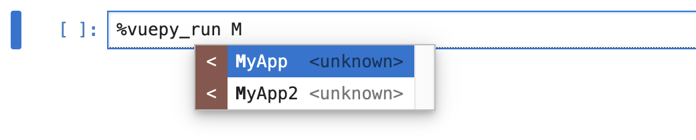

# VuepyAppStore API {#vuepy-appstore-api}

## VuepyAppStore {#vuepyapp-store}

VuepyAppStore 用于存储和管理所有的 Vuepy 应用组件。

为第三方应用提供注册接口，实现通过`%vuepy_run`自动查找（通过自动补全功能）并运行应用。



- **类型**

```py
class VuepyAppStore(metaclass=FactoryMeta):
    @classmethod
    def register(cls, app_name: str, app: Type[VueComponent] | SFCType):
        pass
        
    @classmethod 
    def get(cls, app_name: str) -> Type[VueComponent] | SFCType:
        pass
```

## register() {#register}

注册一个 Vuepy App 组件。

- **类型**

```py
@classmethod
def register(cls, app_name: str, app: Type[VueComponent] | SFCType):
```

- **详细信息**

  第一个参数是组件的名称，第二个参数是要注册的组件。该方法会将组件存储在内部注册表中。

- **示例**

```py
from vuepy import VueComponent, VuepyAppStore

class MyComponent(VueComponent):
    pass

# 注册组件
VuepyAppStore.register('MyApp', MyComponent)
VuepyAppStore.register('MyApp2', MyComponent)
```

  在 Jupyter 中运行`%vuepy_run`时可自动发现已注册 App。


## get() {#get}

通过名称获取已注册的 Vuepy App 组件。

- **类型**

```py
@classmethod
def get(cls, app_name: str) -> Type[VueComponent] | SFCType:
```

- **详细信息**

  接收组件名称作为参数，返回对应的已注册组件。如果组件未注册，将返回 None。

- **示例 1**

```jupyter
# 获取已注册的组件
from vuepy import VuepyAppStore

MyApp = VuepyAppStore.get('MyApp')

# 运行 MyApp
%vuepy_run MyApp
```

- **示例 2**

通过`%vuepy_run`自动查找（通过自动补全功能）并运行应用。


