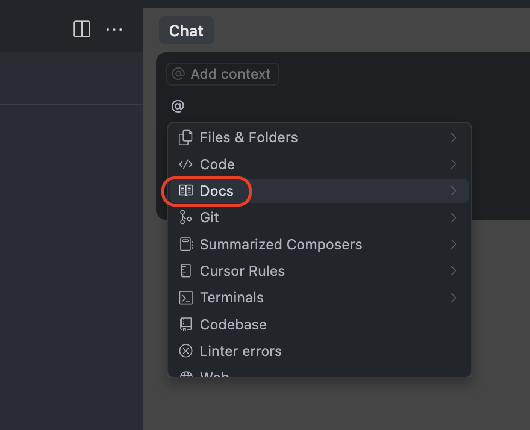
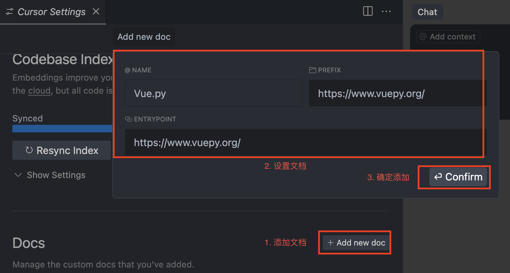
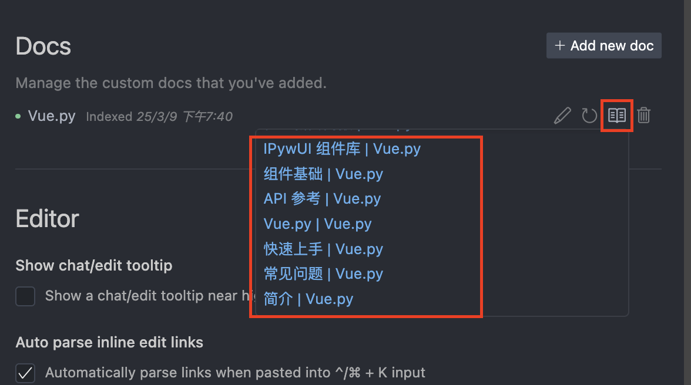
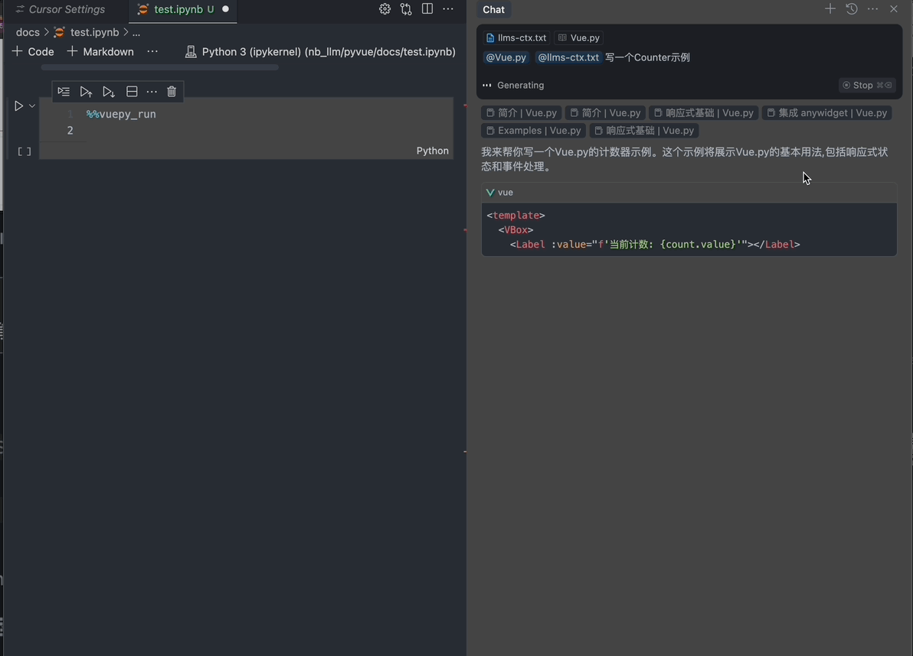

# 使用 LLMs 开发 Vuepy 应用

使用 DeepSeek 等 LLMs 加速您的 Vuepy 应用开发！

本指南将帮助您用 LLMs 来构建 Vuepy 应用。本教程将重点介绍 DeepSeek，但您可以使用任何 LLM 来执行此操作。

## 准备文档 {#preparing-the-documentation}

在开始之前，请收集必要的文档以帮助 DeepSeek 了解 Vuepy：
1. 访问 https://www.vuepy.org/llms-ctx.txt 并复制完整文档文本
2. 将这些文档粘贴到您与 DeepSeek 的对话中

## 描述您的需求 {#describign-your-requirements}

提供文档后，请向 DeepSeek 清楚地描述您想要构建的应用。具体说明：
* 应用提供哪些功能
* UI布局是怎么样的（如果使用支持图片模态的 LLM（如 Claude）可直接将应用截图上传）
* 交互逻辑是什么
* ...

例如：
```
创建一个Vuepy应用：
- 功能类似OpenAI Playground应用，提供chat功能
- 界面采用双栏布局：左侧是参数面板。右侧是历史记录，底部是消息发送和清楚
- 实现流式响应
```

## 使用 DeepSeek 协同工作 {#working-with-deepseek}

在与 DeepSeek 协同工作时：
1. 首先从核心功能开始，然后迭代添加更多功能
2. 让 DeepSeek 解释你不明白的代码
3. 根据需要请求修改或改进
4. 让 DeepSeek 帮助您测试并处理极端情况

DeepSeek 可以帮助实现所有关键的功能：
* UI 设计、实现
* 组件定义和实现
* 错误处理
* 使用方式介绍

## 最佳实践 {#best-practices}

在使用 DeepSeek 构建 Vuepy 应用时：
* 将复杂的功能分解成更小的部分，比如拆分成独立组件，依次实现
* 在继续开发之前先测试已经完成的组件

## 下一步 {#next-steps}

在 DeepSeek 帮助您构建应用之后：
1. 仔细检查生成的代码
2. 对应用进行测试
3. 根据实际使用情况和反馈进行迭代

需要更多帮助？您可以直接向 DeepSeek 咨询具体问题，例如 Vuepy 功能实现细节或项目开发中遇到的故障排查。

## 进阶：结合 Cursor 使用 {#advanced-usage}

Vuepy 文档网站支持 [llms.txt协议](https://llmstxt.org/)，既可供用户直接查阅，也可无缝对接各种支持该协议的工具进行使用。下面简要介绍使用流程及相关概述。

### 在 Cursor 中使用本文档

配置 `Cursor` 的 `@Docs` 数据源，可以很方便地将本文档给 `Cursor` 使用。





**在 Cursor 中使用:**  
为了增加准确性，可以下载 https://www.vuepy.org/llms-ctx.txt 并作为文件上下文提供给 Cursor。



### 在其他工具中使用

其他平台如果支持llms.txt 协议，也可以直接使用。 比如可在 ChatGPT 中使用。


扩展阅读：
- The /llms.txt file, https://llmstxt.org/
- @Docs, https://docs.cursor.com/context/@-symbols/@-docs
- LLMs.txt：AI时代的站点地图, https://juejin.cn/post/7447083753187328050
